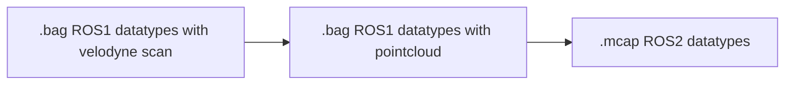

This node is used to process Montemorency data files. In order to use this node, original ROS1 Montemorency data will need to be converted to MCAP (instructions below). Once in MCAP file format, this node converts the ROS2 Pointcloud2 data to PCL Pointcloud2 in order to use segmentation to to get separate tree trunks.

[Montemorency Dataset](https://norlab.ulaval.ca/research/montmorencydataset/)

## Dependancies

[Docker Compose](https://docs.docker.com/compose/install/) for converting Montemorency data to MCAP file format.

[ROS2](https://docs.ros.org/en/jazzy/index.html) for running the montemorency_pcl processing node.

# Converting Montemorency data to MCAP

This will convert the original Montemorency data to MCAP format through the following flow:



1. Run the docker container with the following command from the root directory of this repo. This will put you directly into the container.

```
docker compose run ros1ros2
```

> **_Note:_** To find the `<container-id>` used in the commands below, either see the `root@<container-id>:/#` from the container entered using the above command or in a separate terminal run `docker ps`

2. Convert .bag ROS1 velodyne scan to .bag ROS1 pointcloud

   a. Copy the Montemorency .bag file to be converted to MCAP

   ```
   docker cp <file-to-convert>.bag <container-id>:/
   ```

   b. Run the velodyne to pointcloud node

   ```
   # docker terminal B (ROS1)

   # In a separate terminal connect to the docker container
   docker exec -it <container-id> bash

   source /opt/ros/noetic/setup.bash
   rosrun nodelet nodelet standalone velodyne_pointcloud/TransformNodelet _model:="32E" _calibration:="/opt/ros/noetic/share/velodyne_pointcloud/params/32db.yaml" _min_range:=0.0
   ```

   c. Record

   ```
   # docker terminal C (ROS1)

   # In a separate terminal connect to the docker container
   docker exec -it <container-id> bash

   source /opt/ros/noetic/setup.bash
   rosbag record -a
   ```

   d. Play the file to be converted

   ```
   # docker terminal D (ROS1)

   # In a separate terminal connect to the docker container
   docker exec -it <container-id> bash

   source /opt/ros/noetic/setup.bash
   rosbag play <file-to-convert>.bag
   ```

3. Convert .bag with ROS1 message types to .mcap with ROS2 message types

   a. Run ros1 to ros2 bridge

   ```
   # docker terminal B (ROS1 & ROS2)

   # In a separate terminal connect to the docker container
   docker exec -it <container-id> bash

   source /opt/ros/noetic/setup.bash
   source /opt/ros/galactic/setup.bash
   ros2 run ros1_bridge dynamic_bridge --bridge-all-topics
   ```

   b. Record (this will produce the mcap file)

   ```
   # docker terminal C (ROS2)

   # In a separate terminal connect to the docker container
   docker exec -it <container-id> bash

   source /opt/ros/galactic/setup.bash
   ros2 bag record -s mcap --all
   ```

   c. Play file to be converted (use the file produced from 2.c. above)

   ```
   # docker terminal D (ROS1)

   # In a separate terminal connect to the docker container
   docker exec -it <container-id> bash

   source /opt/ros/noetic/setup.bash
   rosbag play <file-to-convert>.bag
   ```

## Building

```
git clone https://github.com/alexern14/montemorency-ros2-node.git
cd montemorency-ros2-node

# source where you have ros2 installed
source /opt/ros/jazzy/setup.bash
colcon build
```

## Running

Source where you have ros2 installed

```
source /opt/ros/jazzy/setup.bash
```

Run the node from the root directory of this repo

```
source install/setup.bash
ros2 run montemorency montemorency_pcl
```

In a separate terminal, play the mcap file to process

```
# source ros2
source /opt/ros/jazzy/setup.bash

ros2 bag play <file-to-process>.mcap
```

In a separate terminal, record. This new file will have all topics including the processed ones.

```
# source ros2
source /opt/ros/jazzy/setup.bash

ros2 bag record -s mcap --all
```
